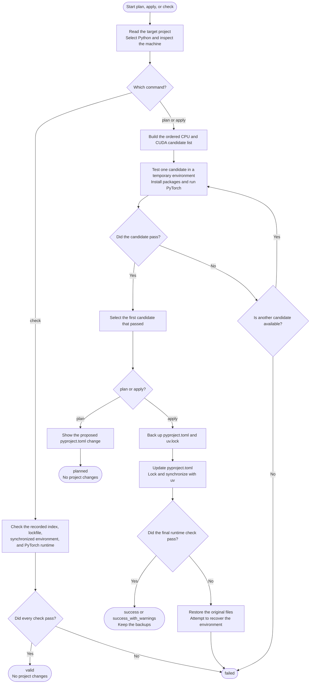

# How selection works

[日本語](how-it-works_ja.md) · [Documentation index](README.md) · [Project README](../README.md)

A backend is a PyTorch build for CPU or NVIDIA CUDA. uv-torch-compass resolves package requirements, tests candidate backends in isolation, and accepts the first candidate that passes all requested checks.

This is a compatibility search, not a performance comparison. A successful candidate satisfies the declared versions and runs on the current machine, but the tool does not claim that it is the fastest possible build.

## Process overview

The diagram below follows one command from start to finish. A rectangle is an operation, a diamond is a decision, and an arrow shows what happens next.



Candidate tests run in temporary virtual environments, so failed candidates do not modify the target project. Only `apply` writes the selected index. If an error occurs after backups are created, the tool restores the original files and attempts to recover the project environment.

## Python selection

An explicit `--python` or `UV_TORCH_COMPASS_PYTHON` request has the highest priority. Otherwise, the tool asks uv to resolve the first non-comment value in `.python-version`, then falls back to `[project].requires-python` if necessary.

The request is passed to uv without reducing it to a numeric version, so CPython and PyPy requests, variants, specifiers, download keys, and executable paths remain available. Resolution runs from the target project with system-interpreter selection, which avoids accidentally reusing the caller's unrelated `.venv`.

The resolved interpreter reports its own version. That version must satisfy `requires-python`; when the project has no upper bound, the result warns that only one Python version was verified.

## Backend policies

| Value | Candidates |
| --- | --- |
| `auto` | On stable: uv automatic selection, driver-compatible CUDA candidates, then CPU. On nightly: compatible CUDA candidates, then CPU. |
| `cuda` | Driver-compatible CUDA candidates only; CPU is not used. |
| `cpu` | Official CPU index only. |
| `cuNNN` | That exact CUDA index only, after driver compatibility is checked. |

CUDA identifiers are obtained from the installed uv's `--torch-backend` help and sorted from newer to older. If uv cannot advertise a list, the tool uses a bounded built-in list and records a warning. The NVIDIA driver's reported CUDA maximum removes clearly unsupported candidates, but an actual PyTorch calculation makes the final decision.

`auto` is tried first on the stable channel because it is uv's own policy. If uv resolves `auto` to CPU and the runtime checks pass, the search stops; later CUDA candidates are not benchmarked.

## Stable and nightly channels

`stable` uses URLs such as:

```text
https://download.pytorch.org/whl/cpu
https://download.pytorch.org/whl/cu128
```

`nightly` is explicit consent to prerelease packages and uses:

```text
https://download.pytorch.org/whl/nightly/cpu
https://download.pytorch.org/whl/nightly/cu128
```

Stable failures never switch to nightly automatically. Nightly candidate installation allows prereleases, and reported package versions are validated with prerelease-aware version rules.

## GPU selection

`nvidia-smi` must return valid device rows and a parseable CUDA maximum. A failed command, malformed output, or missing requested device is not treated as successful inspection.

`--cuda-device` accepts an `nvidia-smi` index or full GPU UUID. Without it, the first value from `CUDA_VISIBLE_DEVICES` is honored when present; otherwise, the first reported GPU is selected. The selected GPU's UUID is passed to the runtime so it becomes logical `cuda:0` even on a multi-GPU host.

When CUDA is required, missing or invalid NVIDIA information is an error. Under `auto`, the same condition produces a warning and leaves automatic/CPU candidates available.

## Runtime probe

Each candidate is installed in a new temporary virtual environment with only the selected PyTorch requirements and any necessary NumPy constraint. The probe returns JSON that the parent process validates again.

| Check | Required behavior |
| --- | --- |
| Packages | Reported `torch`, `torchvision`, and `torchaudio` versions satisfy each selected requirement. |
| CPU | A fixed tensor calculation returns the expected value. |
| NumPy bridge | Tensor-to-array and array-to-Tensor round trips preserve values. |
| CPU backend | The installed build reports neither CUDA nor ROCm. |
| CUDA backend | CUDA is available and tensor allocation, calculation, synchronization, CPU transfer, and NumPy conversion succeed on the selected GPU. |
| torchvision | Import and a representative `torchvision.ops.nms` operation succeed when selected. |
| torchaudio | Import and a torch-connected gain operation succeed when selected. |

ROCm is detected and rejected explicitly. Runtime decisions use ordinary conditional errors rather than `assert`, so optimized Python cannot disable checks.

If only the NumPy bridge fails, the candidate is retried once with `numpy<2`. The target scope receives a Linux-only `numpy<2` requirement only when that retry succeeds.

## Apply phases

The command reports meaningful phases rather than a fixed step count:

1. `inspect`: resolve workspace, requirements, Python, and host information;
2. `resolve`: build the deterministic candidate sequence;
3. `verify`: install and execute candidates in temporary environments;
4. `apply`: back up, edit, lock, sync, and validate the final environment;
5. `restore`: restore files and attempt environment recovery after a failure.

`plan` stops after generating a verified zero-context diff. `check` skips candidate search and validates the already recorded state. Both invalidate their result if `pyproject.toml` or `uv.lock` changes during the command.

Continue with [Projects and dependency scopes](projects-and-scopes.md) for TOML and workspace behavior.
