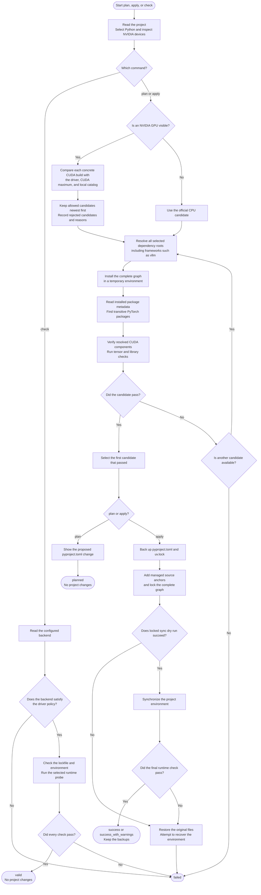

# How selection works

[日本語](how-it-works_ja.md) · [Documentation index](README.md) · [Project README](../README.md)

A backend is a PyTorch build for CPU or NVIDIA CUDA. uv-torch-compass resolves package requirements, tests candidate backends in isolation, and accepts the first candidate that passes all requested checks.

This is a compatibility search, not a performance comparison. A successful candidate satisfies the declared versions and runs on the current machine, but the tool does not claim that it is the fastest possible build.

## Process overview

The diagram below follows one command from start to finish. A rectangle is an operation, a diamond is a decision, and an arrow shows what happens next.



Candidate tests run in temporary virtual environments, so failed candidates do not modify the target project. Only `apply` writes the selected index. If an error occurs after backups are created, the tool restores the original files and attempts to recover the project environment.

## Python selection

An explicit `--python` or `UV_TORCH_COMPASS_PYTHON` request has the highest priority. Otherwise, the tool asks uv to resolve the first non-comment value in `.python-version`, then falls back to `[project].requires-python` if necessary.

The request is passed to uv without reducing it to a numeric version, so CPython and PyPy requests, variants, specifiers, download keys, and executable paths remain available. Resolution runs from the target project with system-interpreter selection, which avoids accidentally reusing the caller's unrelated `.venv`.

The resolved interpreter reports its own version. That version must satisfy `requires-python`; when the project has no upper bound, the result warns that only one Python version was verified.

## Backend policies

| Value | Candidates |
| --- | --- |
| `auto` | With an NVIDIA GPU: allowed concrete CUDA candidates only. Without one: CPU only. A failed GPU search never falls back to CPU. |
| `cuda` | Driver-compatible CUDA candidates only; CPU is not used. |
| `cpu` | Official CPU index only. |
| `cuNNN` | That exact CUDA index only, after driver compatibility is checked. |

CUDA identifiers are obtained from the installed uv's `--torch-backend` help and sorted from newer to older. Raw `uv --torch-backend auto` is not a candidate because it could choose a runtime before uv-torch-compass applies its safety policy. If uv cannot advertise a list, the tool uses a bounded built-in list and records a warning.

The default `strict` policy requires all three checks below:

1. the backend exists in the bundled, version-controlled compatibility catalog;
2. the selected driver meets the catalogued full-support minimum;
3. the backend runtime is no newer than the CUDA maximum reported by `nvidia-smi`.

`--cuda-compatibility minor` explicitly allows NVIDIA's limited minor-version compatibility within the same CUDA major family. It never crosses from CUDA 12 to CUDA 13. A minor-compatible candidate must also include native machine code for the selected GPU; a build that can rely only on PTX is rejected. If selected, text, logs, and JSON retain a warning and the result becomes `success_with_warnings`.

Unknown backends, component versions, and driver boundaries fail closed. The conservative boundaries come from the [NVIDIA CUDA Toolkit release notes](https://docs.nvidia.com/cuda/cuda-toolkit-release-notes/) and the [CUDA minor-version compatibility guide](https://docs.nvidia.com/deploy/cuda-compatibility/minor-version-compatibility.html). The catalog is not downloaded at runtime, so a newly published CUDA backend requires a uv-torch-compass update before automatic use.

## `nvidia-smi` CUDA and the PyTorch runtime

The `CUDA Version` printed by `nvidia-smi` is the highest CUDA level that the installed driver reports. It is not the CUDA runtime bundled with a PyTorch wheel. For example, a `cu124` PyTorch wheel contains CUDA 12.4 runtime components even when no system CUDA toolkit is installed.

uv-torch-compass records both values and also checks the installed runtime component package. Under `strict`, a driver that reports CUDA 12.4 cannot select `cu128` or `cu129`. Under explicit `minor`, a newer CUDA 12.x runtime may be tested only when the catalogued minimum driver and architecture rules are satisfied.

## Stable and nightly channels

`stable` uses URLs such as:

```text
https://download.pytorch.org/whl/cpu
https://download.pytorch.org/whl/cu128
```

`nightly` is explicit consent to prerelease packages and uses:

```text
https://download.pytorch.org/whl/nightly/cpu
https://download.pytorch.org/whl/nightly/cu128
```

Stable failures never switch to nightly automatically. Nightly candidate installation allows prereleases, and reported package versions are validated with prerelease-aware version rules.

## GPU selection

`nvidia-smi` must return valid device rows and a parseable CUDA maximum. A failed command, malformed output, or missing requested device is not treated as successful inspection.

`--cuda-device` accepts an `nvidia-smi` index or full GPU UUID. Without it, the first value from `CUDA_VISIBLE_DEVICES` is honored when present; otherwise, the first reported GPU is selected. The selected GPU's UUID is passed to the runtime so it becomes logical `cuda:0` even on a multi-GPU host.

When CUDA is required, missing NVIDIA information is an error. With `auto`, an absent `nvidia-smi` means the host is treated as CPU-only. If `nvidia-smi` exists but fails or returns malformed data, the command fails instead of treating uncertain NVIDIA state as a CPU-only host.

## Runtime probe

Each candidate is installed in a new temporary virtual environment from every dependency root in the selected base, extras, and groups. This lets constraints from packages such as `vllm` determine the compatible PyTorch versions. Installed `dist-info` metadata is inspected without importing third-party packages; discovered PyTorch packages are then runtime-tested. The probe returns JSON that the parent process validates again.

| Check | Required behavior |
| --- | --- |
| Packages | Reported `torch`, `torchvision`, and `torchaudio` versions satisfy each selected requirement. |
| CPU | A fixed tensor calculation returns the expected value. |
| NumPy bridge | Tensor-to-array and array-to-Tensor round trips preserve values. |
| CPU backend | The installed build reports neither CUDA nor ROCm. |
| CUDA identity | The selected backend, `torch.version.cuda`, and installed CUDA runtime component have the same major and minor version. |
| CUDA backend | CUDA is available and tensor allocation, calculation, synchronization, CPU transfer, and NumPy conversion succeed on the selected GPU. |
| cuBLAS | A small GPU matrix multiplication returns the expected values. |
| cuDNN | A valid cuDNN version is reported and a small GPU convolution returns the expected values. |
| Architecture | The GPU compute capability and PyTorch compiled architecture list are reported. Minor mode requires an exact native `sm_NN` entry. |
| torchvision | Import and GPU `torchvision.ops.nms` succeed when selected with CUDA. |
| torchaudio | Import and a torch-connected GPU gain operation succeed when selected with CUDA. |
| Compile profile | With `--probe-profile compile`, a small deterministic `torch.compile` function compiles and runs. |

ROCm is detected and rejected explicitly. Runtime decisions use ordinary conditional errors rather than `assert`, so optimized Python cannot disable checks.

If only the NumPy bridge fails, the candidate is retried once with `numpy<2`. The target scope receives a Linux-only `numpy<2` requirement only when that retry succeeds.

The default `standard` profile performs every check in the table except the compile-profile row. `compile` adds the Inductor/Triton path and does not install extra packages merely to make that check pass.

## Existing CUDA source settings

`check` applies the current policy to an index that is already recorded in `pyproject.toml`. For example, an existing `cu129` source on driver 550.100 fails under default `strict` without changing the project. Use `plan` to preview a supported replacement.

Use `--cuda-compatibility minor` only when you intentionally accept the documented limitations. After a driver update, run `plan` again and apply the newly eligible strict candidate if appropriate.

## Apply phases

The command reports meaningful phases rather than a fixed step count:

1. `inspect`: resolve workspace, requirements, Python, and host information;
2. `resolve`: build the deterministic candidate sequence;
3. `verify`: install and execute candidates in temporary environments;
4. `apply`: back up, edit, lock, dry-run sync, synchronize, and validate the final environment;
5. `restore`: restore files and attempt environment recovery after a failure.

`plan` stops after generating a verified zero-context diff. `check` skips candidate search and validates the already recorded state. Both invalidate their result if `pyproject.toml` or `uv.lock` changes during the command.

Continue with [Projects and dependency scopes](projects-and-scopes.md) for TOML and workspace behavior.
