# 選択の仕組み

[English](how-it-works.md) · [ドキュメント一覧](README_ja.md) · [プロジェクト README](../README_ja.md)

backend は、CPU または NVIDIA CUDA 用の PyTorch build です。uv-torch-compass は依存条件を解決し、隔離した環境で候補を検証して、必要な確認をすべて通過した最初の候補を採用します。

これは互換性を探す処理であり、性能比較ではありません。採用した候補は指定 version を満たし、現在のコンピューターで動作しますが、最速の build であることを保証するものではありません。

## 処理の全体像

次の図は、一つの command が始まってから終わるまでの流れです。四角形は処理、ひし形は判断、矢印は次に進む方向を表します。

```mermaid
flowchart TD
    Start([plan、apply、check のいずれかを開始])
    Inspect[対象 project を読み込む<br/>Python を選び、NVIDIA device を調べる]
    Command{どの command か}

    Check[設定済み backend を読み込む]
    CheckPolicy{backend は driver 方針を<br/>満たしているか}
    CheckRuntime[lockfile と環境を確認する<br/>選択した runtime probe を実行する]
    CheckResult{すべて正常か}
    Valid([valid<br/>project は変更しない])

    Driver{NVIDIA GPU が見えるか}
    Policy[具体的な CUDA build ごとに<br/>driver、CUDA 上限、組み込み表を照合する]
    Candidates[許可した候補を新しい順に並べる<br/>除外した理由も記録する]
    ExactFramework{完全指定した公式 vLLM に<br/>確認済み backend があるか}
    ExactNarrow[lock 前に確認済み backend だけへ絞る]
    CPU[公式 CPU 候補を使う]
    Environment[一時 project を選択した Python、<br/>Linux、architecture に限定する]
    Roots[vllm なども含む<br/>選択済みの依存ルートを引き継ぐ]
    SourcePolicy[対象の関連 source 方針を引き継ぎ<br/>PyTorch だけを候補 index へ向ける]
    Lock[依存グラフ全体を lock する]
    Metadata[uv workspace metadata JSON を読む<br/>または lock schema 1 を検証して読む]
    Anchors{見つかった PyTorch package は<br/>すべて選択 index を使うか}
    Relock[不足する version なし anchor を<br/>一度だけ追加して再 lock する]
    Artifact[lock 済み vLLM wheel だけを展開する<br/>import や実行はしない]
    ArtifactPolicy{確認済み catalog と ELF library は<br/>backend と一致するか}
    Narrow[必要な CUDA variant だけに絞る<br/>driver 対応候補がなければ停止する]
    RangeRetry{直接の vLLM 範囲指定で<br/>未検証 release があるか}
    ExcludeVersion[一時候補だけで解決済み release を除外する]
    Temporary[検証済み lock を<br/>一時環境へ install する]
    Runtime[解決した CUDA component を確認し<br/>tensor と library の検証を行う]
    Framework[自動検出または明示した framework を検証する<br/>利用者の model は読み込まない]
    CandidateResult{候補は検証を通過したか}
    Diagnose[認証情報を除いた uv の失敗を分類し<br/>package、requirement、index を記録する]
    Independent{backend を変えても<br/>同じ失敗か}
    More{次の関連候補があるか}
    Selected[最初に通過した候補を選ぶ]
    Action{plan か apply か}
    Plan[pyproject.toml の変更案を表示する]
    Planned([planned<br/>project は変更しない])

    Backup[pyproject.toml と uv.lock を backup する]
    Update[管理対象の source anchor を追加し<br/>依存グラフ全体を lock する]
    Preflight{locked sync の dry run に成功したか}
    Sync[project 環境を同期する]
    FinalCheck{更新後の実行検証に成功したか}
    Success([success または success_with_warnings<br/>backup は残す])
    Report{指定した report を<br/>保存できたか}
    ReportFailure([report の失敗<br/>project は適用済み])
    Restore[元のファイルへ戻す<br/>project 環境の復旧も試す]
    Failed([failed])

    Start --> Inspect --> Command
    Command -- check --> Check --> CheckPolicy
    CheckPolicy -- いいえ --> Failed
    CheckPolicy -- はい --> CheckRuntime --> CheckResult
    CheckResult -- はい --> Valid
    CheckResult -- いいえ --> Failed

    Command -- plan または apply --> Driver
    Driver -- はい --> Policy --> Candidates --> ExactFramework
    Driver -- いいえ --> CPU --> ExactFramework
    ExactFramework -- ある --> ExactNarrow --> Environment
    ExactFramework -- ない --> Environment
    Environment --> Roots --> SourcePolicy --> Lock --> Metadata --> Anchors
    Anchors -- いいえ --> Relock --> Lock
    Anchors -- はい --> Artifact --> ArtifactPolicy
    ArtifactPolicy -- 一致または不明 --> Temporary --> Runtime --> Framework --> CandidateResult
    ArtifactPolicy -- 不一致 --> RangeRetry
    RangeRetry -- ある --> ExcludeVersion --> Lock
    RangeRetry -- ない --> Narrow --> More
    CandidateResult -- はい --> Selected --> Action
    CandidateResult -- いいえ --> Diagnose --> Independent
    Independent -- はい --> Failed
    Independent -- いいえ --> More
    More -- はい --> Environment
    More -- いいえ --> Failed

    Action -- plan --> Plan --> Planned
    Action -- apply --> Backup --> Update --> Preflight
    Preflight -- いいえ --> Restore
    Preflight -- はい --> Sync --> FinalCheck
    FinalCheck -- はい --> Report
    Report -- 成功または指定なし --> Success
    Report -- 指定したが失敗 --> ReportFailure
    FinalCheck -- いいえ --> Restore --> Failed
```



候補の検証には一時的な uv project と virtual environment を使うため、候補が失敗しても対象 project は変更されません。一時 resolver は、選択した interpreter implementation、Python minor version、Linux、CPU architecture だけを対象にします。関連する source と解決方針を引き継ぎ、PyTorch だけを候補 index へ向けます。最初に lock し、利用できる場合は uv の JSON workspace metadata から読みます。対応済み lock schema 1 は上限付き fallback です。推移的な PyTorch source が同じ index に収束したことを確認してから、その lock を install します。選んだ index または検証済み vLLM constraint を書き込むのは `apply` だけです。backup 作成後にエラーが起きた場合は、元のファイルへ戻し、project 環境の復旧も試みます。

lock、artifact 検査、install、runtime 検証、framework 検証は別の phase です。lock に成功した時点で、解決済みの PyTorch package を保存します。その後 `xgrammar` などに利用可能な wheel がなくても、PyTorch の結果を捨てず、その package と依存経路を原因として表示します。既知の uv エラーは認証情報と制御文字を除去してから解析します。英文の構成語を package 名として受理せず、未知の形式は推測で補わず `unknown` として private log へ案内します。

## Python の選択

明示した `--python` または `UV_TORCH_COMPASS_PYTHON` が最優先です。指定がなければ、`.python-version` の最初のコメント以外の値を uv で解決し、必要に応じて `[project].requires-python` へ切り替えます。

request を数値 version へ単純化せず uv に渡すため、CPython・PyPy、variant、specifier、download key、実行ファイルのパスを利用できます。対象 project から system interpreter として解決するので、呼び出し元の無関係な `.venv` を誤って使いません。

選ばれた interpreter 自身から version を取得し、`requires-python` を満たすか確認します。上限がない場合は、一つの Python version だけを検証したことを警告します。

## backend の方針

| 値 | 候補 |
| --- | --- |
| `auto` | NVIDIA GPU があれば許可済みの具体的な CUDA だけ。なければ CPU だけ。GPU 候補の失敗から CPU へ切り替えない |
| `cuda` | driver と両立する CUDA だけ。CPU は使わない |
| `cpu` | 公式 CPU index だけ |
| `cuNNN` | driver との両立を確認したうえで、その CUDA index だけ |

CUDA の識別子は、インストール済み uv の `--torch-backend` help から取得し、新しい順に並べます。生の `uv --torch-backend auto` は、uv-torch-compass の安全方針より先に runtime を決める可能性があるため候補にしません。uv から一覧を取得できない場合だけ、上限のある組み込み一覧を使って警告します。

初期値の `strict` は、次の三条件をすべて要求します。

1. backend が version 管理された組み込み互換性表にある
2. 選択した driver が表にある通常サポートの最低 version 以上である
3. backend の runtime が `nvidia-smi` の CUDA 上限を超えない

`--cuda-compatibility minor` は、NVIDIA の制限付き minor-version compatibility を同じ CUDA major 系列内だけで明示的に許可します。CUDA 12 から CUDA 13 をまたぐことはありません。minor 候補では、選択した GPU 用の native machine code も必要です。PTX だけに依存できる build は拒否します。採用した場合は text、log、JSON に警告を残し、結果を `success_with_warnings` とします。

未知の backend、component version、driver 境界は安全側に倒して拒否します。保守的な境界値は [NVIDIA CUDA Toolkit release notes](https://docs.nvidia.com/cuda/cuda-toolkit-release-notes/) と [CUDA minor-version compatibility guide](https://docs.nvidia.com/deploy/cuda-compatibility/minor-version-compatibility.html) に基づきます。互換性表には出典と人が確認した日付を記録し、週次の読み取り専用 workflow で出典への到達性と確認日の古さを検査します。互換性表を実行時に download しないため、新しい CUDA backend を自動採用するには、人が内容を確認した uv-torch-compass の更新が必要です。

## `nvidia-smi` の CUDA と PyTorch runtime

`nvidia-smi` の `CUDA Version` は、インストール済み driver が示す CUDA の上限です。PyTorch wheel に同梱された CUDA runtime の version ではありません。たとえば `cu124` の PyTorch wheel は、system CUDA toolkit がなくても CUDA 12.4 の runtime component を含みます。

uv-torch-compass は両方の値に加え、インストール済み runtime component package も記録・確認します。`strict` では、CUDA 12.4 と表示する driver に `cu128` や `cu129` を選びません。明示した `minor` では、互換性表の最低 driver と architecture の条件を満たす場合だけ、新しい CUDA 12.x runtime を検証できます。

## stable と nightly

`stable` は次のような URL を使います。

```text
https://download.pytorch.org/whl/cpu
https://download.pytorch.org/whl/cu128
```

`nightly` は prerelease package を使うことへの明示的な同意であり、次の URL を使います。

```text
https://download.pytorch.org/whl/nightly/cpu
https://download.pytorch.org/whl/nightly/cu128
```

stable の失敗から nightly へ自動で移りません。nightly の install では prerelease を許可し、報告された package version も prerelease を考慮して検証します。

## GPU の選択

`nvidia-smi` は、正しい device 行と解析可能な CUDA 上限を返す必要があります。command の失敗、不正な出力、指定 device の不在を検出成功として扱いません。

`--cuda-device` には `nvidia-smi` の index または完全な GPU UUID を指定できます。省略時は `CUDA_VISIBLE_DEVICES` があればその先頭、なければ見えている GPU のうち空き memory が最大のものを選びます。これは使用中の先頭 GPU を避けるための選択であり、memory の予約ではありません。選択した GPU の UUID を runtime へ渡すため、複数 GPU の環境でも論理的な `cuda:0` になります。

## framework 検証

lock に vLLM が含まれる場合、まず uv の選択 install option でその wheel だけを展開します。この phase では wheel を import しません。標準 library だけの parser が ELF の `DT_NEEDED` から `libcudart.so.12` や `.13` を読み取ります。公式 wheel について人が確認した小さな offline catalog と組み合わせて判定します。local、Git、独自 index、source distribution には公式 wheel の variant を推測で当てはめず、runtime 検証へ進みます。catalog と ELF が矛盾する場合は安全側で失敗します。

vLLM 0.6.0 のように確認済み公式 release を完全指定した場合は、最初の lock より前に backend を絞れます。直接の version 範囲が、CUDA ABI の合わない新しい release を解決した場合は、破棄可能な候補内だけでその release を除外し、同じ backend を再度 lock します。試すのは異なる16 releaseまでです。代替 release がすべての検証を通過した場合、`apply` は元の範囲指定を残し、検証済み release をツール管理の uv constraint として記録します。

PyTorch runtime probe のあとは、範囲を限定した vLLM 連携検証を自動実行します。`--framework-probe vllm` は同じ検証を明示的な要求として記録し、自動検出と重複しません。install 済み version、通常 import、native extension、CPU または CUDA platform を確認します。例外は認証情報を除去した message と最大 12 frame に制限します。`DTensor` などの Python API 失敗を、CUDA library 不足や native symbol 不一致とは分けて分類します。backend に依存しない API 失敗なら残り候補を止め、CUDA ABI 失敗なら必要な major または確認済み variant に候補を絞ります。

どちらの framework phase も model の取得、engine の起動、worker の開始、model 規模の GPU memory 確保は行いません。`apply` 後と `check` でも runtime 検証を行います。検証済みの uv 最低 version は 0.11.28 です。古い uv では警告を出し、選択 install option がなければ artifact phase だけを完全検証へ fallback します。

CUDA を必須にした場合、NVIDIA 情報の欠落はエラーです。`auto` では `nvidia-smi` がなければ CPU 専用 host として扱います。`nvidia-smi` が存在するのに失敗した場合や出力が不正な場合は、不明な NVIDIA 状態を CPU 専用とみなさず失敗します。

## runtime probe

候補ごとに、選択した Linux 実行環境だけを対象として最初に lock し、その lock から新しい一時 virtual environment へインストールします。利用可能な wheel がある version へ uv が戻って選び直せる一方、`vllm` などの version 制約も PyTorch の解決に反映されます。無関係な第三者 package を import せず、install 済みの `dist-info` metadata から PyTorch package を見つけて実行検証します。probe は JSON を返し、親 process が内容をもう一度検証します。

| 確認 | 必要な動作 |
| --- | --- |
| package | `torch`、`torchvision`、`torchaudio` の報告 version が選択した各依存条件を満たす |
| CPU | 固定した tensor 計算が期待値になる |
| NumPy bridge | Tensor から array、array から Tensor の往復で値を維持する |
| CPU backend | CUDA と ROCm のどちらでもない build である |
| CUDA identity | 選択 backend、`torch.version.cuda`、インストール済み CUDA runtime component の major・minor が一致する |
| CUDA backend | 選択 GPU で CUDA の検出、tensor の作成・計算・同期、CPU 転送、NumPy 変換に成功する |
| cuBLAS | 小さな GPU 行列積が期待値になる |
| cuDNN | 正しい cuDNN version を取得でき、小さな GPU 畳み込みが期待値になる |
| architecture | GPU の compute capability と PyTorch の compiled architecture を報告する。minor では完全一致する native `sm_NN` を要求する |
| torchvision | CUDA 選択時は GPU 上の `torchvision.ops.nms` が成功する |
| torchaudio | CUDA 選択時は GPU tensor を使う gain 処理が成功する |
| compile profile | `--probe-profile compile` では、小さな決定的関数を `torch.compile` して実行できる |

ROCm は検出して明示的に拒否します。runtime 判定は `assert` ではなく通常の条件分岐と例外を使うため、Python の最適化で無効になりません。

NumPy bridge だけが失敗した場合は、`numpy<2` を使って一度だけ再試行します。成功した場合に限り、対象の依存範囲へ Linux 限定の `numpy<2` を追加します。

初期値の `standard` profile は、表の compile profile 以外をすべて確認します。`compile` は Inductor／Triton 経路を追加し、その確認だけのために追加 package をインストールしません。

## 既存の CUDA source 設定

`check` は、`pyproject.toml` に記録済みの index にも現在の方針を適用します。たとえば driver 550.100 上の既存 `cu129` source は、初期値の `strict` では project を変更せず失敗します。対応する置き換え案は `plan` で確認してください。

`--cuda-compatibility minor` は、制約を理解して意図的に許可する場合だけ使います。driver 更新後は `plan` を再実行し、必要なら新たに利用可能になった strict 候補を `apply` してください。

## apply の phase

固定した段階数ではなく、意味のある phase を表示します。

1. `inspect`: workspace、依存条件、Python、host 情報を解決する
2. `resolve`: 再現可能な順序で候補を組み立てる
3. `verify`: 一時環境へ候補を install して実行する
4. `apply`: backup、編集、lock、sync の dry run、同期、最終環境の検証を行う
5. `restore`: 失敗後にファイルを戻し、環境の復旧を試す

`plan` は検証済みの前後行なし diff を作って終了します。`check` は候補探索を省き、記録済みの状態を検証します。どちらも実行中に `pyproject.toml` または `uv.lock` が変わると結果を無効にします。

TOML と workspace の扱いは[プロジェクトと依存範囲](projects-and-scopes_ja.md)へ進んでください。
