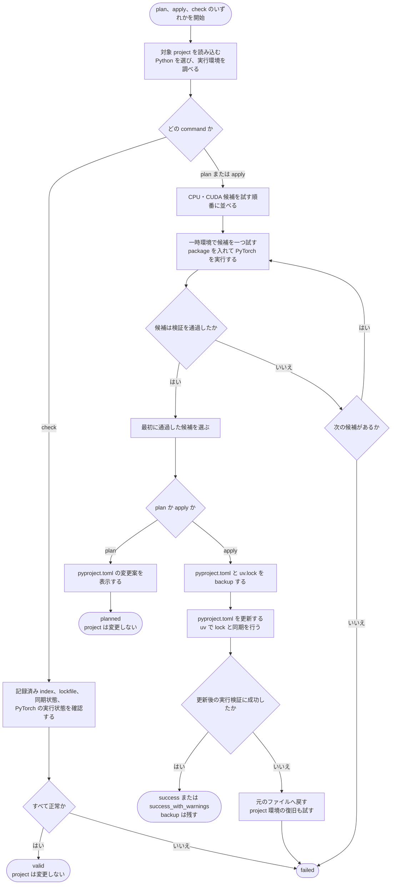

# 選択の仕組み

[English](how-it-works.md) · [ドキュメント一覧](README_ja.md) · [プロジェクト README](../README_ja.md)

backend は、CPU または NVIDIA CUDA 用の PyTorch build です。uv-torch-compass は依存条件を解決し、隔離した環境で候補を検証して、必要な確認をすべて通過した最初の候補を採用します。

これは互換性を探す処理であり、性能比較ではありません。採用した候補は指定 version を満たし、現在のコンピューターで動作しますが、最速の build であることを保証するものではありません。

## 処理の全体像

次の図は、一つの command が始まってから終わるまでの流れです。四角形は処理、ひし形は判断、矢印は次に進む方向を表します。



候補の検証には一時的な virtual environment を使うため、候補が失敗しても対象 project は変更されません。選んだ index を書き込むのは `apply` だけです。backup 作成後にエラーが起きた場合は、元のファイルへ戻し、project 環境の復旧も試みます。

## Python の選択

明示した `--python` または `UV_TORCH_COMPASS_PYTHON` が最優先です。指定がなければ、`.python-version` の最初のコメント以外の値を uv で解決し、必要に応じて `[project].requires-python` へ切り替えます。

request を数値 version へ単純化せず uv に渡すため、CPython・PyPy、variant、specifier、download key、実行ファイルのパスを利用できます。対象 project から system interpreter として解決するので、呼び出し元の無関係な `.venv` を誤って使いません。

選ばれた interpreter 自身から version を取得し、`requires-python` を満たすか確認します。上限がない場合は、一つの Python version だけを検証したことを警告します。

## backend の方針

| 値 | 候補 |
| --- | --- |
| `auto` | stable では uv の自動選択、driver と両立する CUDA、CPU の順。nightly では CUDA、CPU の順 |
| `cuda` | driver と両立する CUDA だけ。CPU は使わない |
| `cpu` | 公式 CPU index だけ |
| `cuNNN` | driver との両立を確認したうえで、その CUDA index だけ |

CUDA の識別子は、インストール済み uv の `--torch-backend` help から取得し、新しい順に並べます。uv から一覧を取得できない場合だけ、上限のある組み込み一覧を使って警告します。NVIDIA driver が表示する CUDA 上限で明らかに使えない候補を除外しますが、最終判断は PyTorch の実計算です。

stable の `auto` を最初に試すのは、uv 自身の選択方針を利用するためです。uv が `auto` を CPU として解決し、検証を通過した場合はそこで終了し、後続の CUDA 候補を benchmark しません。

## stable と nightly

`stable` は次のような URL を使います。

```text
https://download.pytorch.org/whl/cpu
https://download.pytorch.org/whl/cu128
```

`nightly` は prerelease package を使うことへの明示的な同意であり、次の URL を使います。

```text
https://download.pytorch.org/whl/nightly/cpu
https://download.pytorch.org/whl/nightly/cu128
```

stable の失敗から nightly へ自動で移りません。nightly の install では prerelease を許可し、報告された package version も prerelease を考慮して検証します。

## GPU の選択

`nvidia-smi` は、正しい device 行と解析可能な CUDA 上限を返す必要があります。command の失敗、不正な出力、指定 device の不在を検出成功として扱いません。

`--cuda-device` には `nvidia-smi` の index または完全な GPU UUID を指定できます。省略時は `CUDA_VISIBLE_DEVICES` があればその先頭、なければ最初に報告された GPU を選びます。選択した GPU の UUID を runtime へ渡すため、複数 GPU の環境でも論理的な `cuda:0` になります。

CUDA を必須にした場合、NVIDIA 情報の欠落・不正はエラーです。`auto` では警告となり、自動選択と CPU 候補を続けます。

## runtime probe

候補ごとに新しい一時 virtual environment を作り、選択した PyTorch 依存条件と、必要になった NumPy 制約だけをインストールします。probe は JSON を返し、親 process が内容をもう一度検証します。

| 確認 | 必要な動作 |
| --- | --- |
| package | `torch`、`torchvision`、`torchaudio` の報告 version が選択した各依存条件を満たす |
| CPU | 固定した tensor 計算が期待値になる |
| NumPy bridge | Tensor から array、array から Tensor の往復で値を維持する |
| CPU backend | CUDA と ROCm のどちらでもない build である |
| CUDA backend | 選択 GPU で CUDA の検出、tensor の作成・計算・同期、CPU 転送、NumPy 変換に成功する |
| torchvision | 選択時に import と代表的な `torchvision.ops.nms` が成功する |
| torchaudio | 選択時に import と torch を使う gain 処理が成功する |

ROCm は検出して明示的に拒否します。runtime 判定は `assert` ではなく通常の条件分岐と例外を使うため、Python の最適化で無効になりません。

NumPy bridge だけが失敗した場合は、`numpy<2` を使って一度だけ再試行します。成功した場合に限り、対象の依存範囲へ Linux 限定の `numpy<2` を追加します。

## apply の phase

固定した段階数ではなく、意味のある phase を表示します。

1. `inspect`: workspace、依存条件、Python、host 情報を解決する
2. `resolve`: 再現可能な順序で候補を組み立てる
3. `verify`: 一時環境へ候補を install して実行する
4. `apply`: backup、編集、lock、sync、最終環境の検証を行う
5. `restore`: 失敗後にファイルを戻し、環境の復旧を試す

`plan` は検証済みの前後行なし diff を作って終了します。`check` は候補探索を省き、記録済みの状態を検証します。どちらも実行中に `pyproject.toml` または `uv.lock` が変わると結果を無効にします。

TOML と workspace の扱いは[プロジェクトと依存範囲](projects-and-scopes_ja.md)へ進んでください。
